<div align="center">

    [](https://github.com/PyCQA/bandit)

#  HỆ THỐNG QUẢN LÝ DỰ ÁN & QUẢN LÝ CÔNG VIỆC

**Giải pháp quản lý dự án và công việc chuyên nghiệp, toàn diện và hiệu quả**

</div>

---

## Tổng Quan Hệ Thống

Hệ thống Quản lý Dự án & Quản lý công việc cung cấp giải pháp toàn diện để quản lý dự án, nhân sự, tài nguyên, chi phí và rủi ro. Với giao diện trực quan và các công cụ phân tích mạnh mẽ, hệ thống giúp tổ chức tối ưu hóa quy trình làm việc và đạt được hiệu suất cao nhất.

---

## Tính Năng Chính

### **Quản lý Dự án**

#### **Danh sách Dự án**
Hiển thị toàn bộ các dự án trong hệ thống với giao diện trực quan. Người dùng có thể xem nhanh trạng thái, tiến độ, và các thông tin quan trọng của tất cả các dự án đang thực hiện.

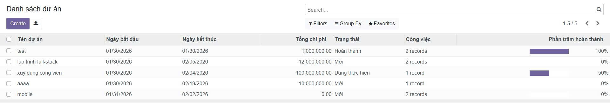

#### **Chi tiết Dự án**
Xem thông tin chi tiết về từng dự án bao gồm: mô tả, mục tiêu, thời gian, ngân sách, thành viên tham gia, và các tài liệu liên quan. Giao diện chi tiết giúp quản lý toàn bộ thông tin dự án ở một nơi.

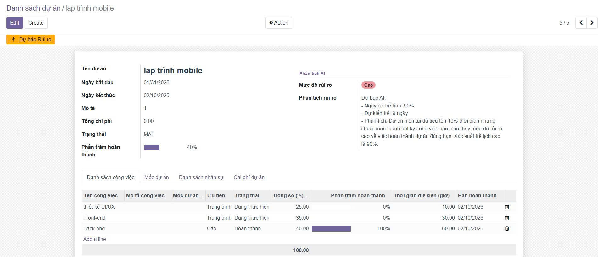

---

### **Quản lý Công việc**

#### **Danh sách Công việc**
Quản lý tất cả các công việc trong dự án với khả năng phân loại theo trạng thái, độ ưu tiên, và người phụ trách. Hệ thống hỗ trợ theo dõi tiến độ từng công việc một cách chi tiết.

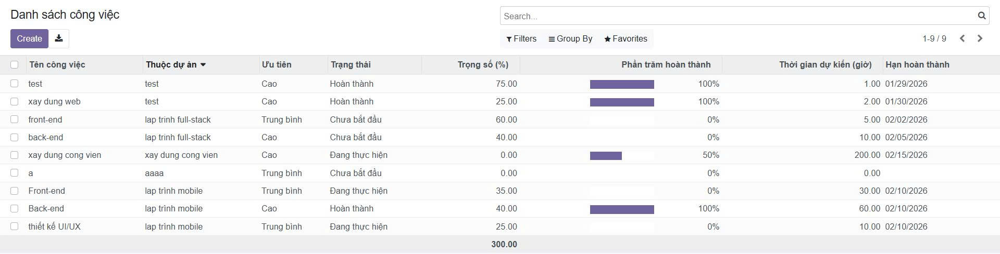

#### **Tác vụ**
Quản lý các tác vụ cụ thể trong mỗi công việc. Cho phép gán nhiệm vụ cho thành viên, thiết lập deadline, và theo dõi trạng thái hoàn thành.

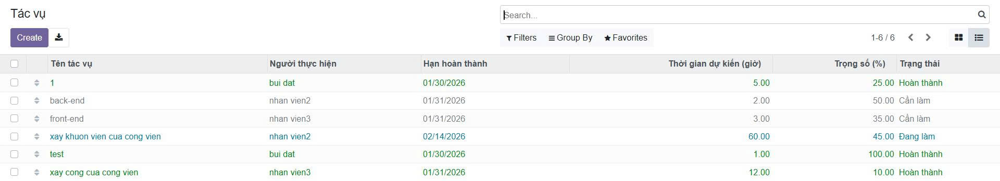

#### **Chi tiết Tác vụ**
Xem thông tin chi tiết về từng tác vụ bao gồm: mô tả, yêu cầu, thời gian dự kiến, thời gian thực tế, và các ghi chú quan trọng.

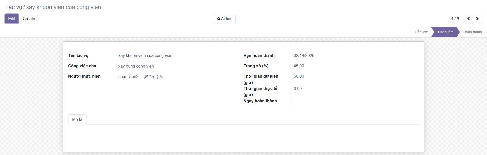

---

### **Quản lý Mốc Dự án**

#### **Mốc Dự án**
Thiết lập và theo dõi các mốc quan trọng (milestones) trong dự án. Giúp đảm bảo dự án đạt được các mục tiêu theo lộ trình đã định.

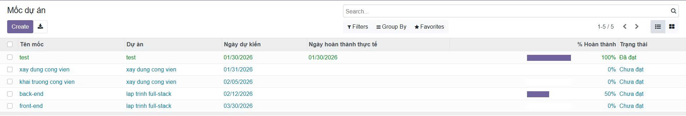

#### **Chi tiết Mốc Dự án**
Xem chi tiết về từng mốc dự án, bao gồm các công việc cần hoàn thành, tiêu chí đánh giá, và kết quả đạt được.

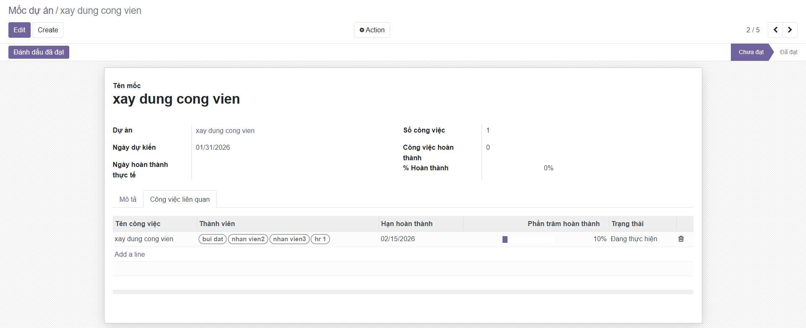

---

### **Quản lý Chi phí & Đầu tư**

#### **Chi phí Dự án**
Theo dõi chi tiết tất cả các khoản chi phí phát sinh trong dự án. Cung cấp báo cáo tài chính để người quản lý dễ dàng kiểm soát ngân sách và tối ưu hóa chi phí.

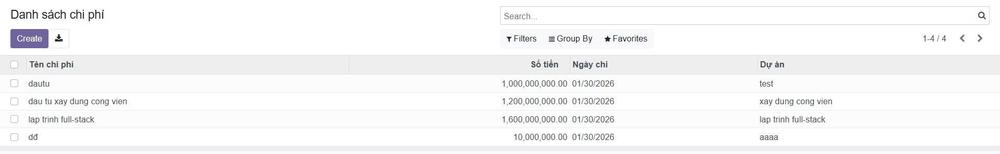

#### **Chi tiết Đầu tư**
Quản lý thông tin về các khoản đầu tư vào dự án, bao gồm nguồn vốn, phân bổ ngân sách, và theo dõi hiệu quả sử dụng vốn.

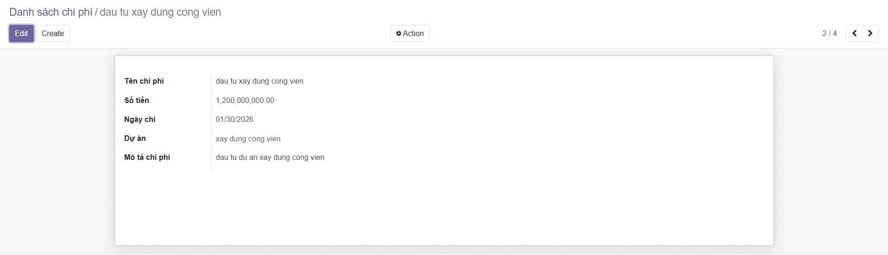

---

### **Quản lý Rủi ro**

#### **Rủi ro Dự án**
Nhận diện, đánh giá và quản lý các rủi ro có thể ảnh hưởng đến dự án. Hệ thống hỗ trợ phân loại rủi ro theo mức độ nghiêm trọng và xác suất xảy ra.

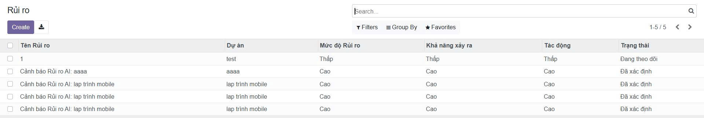

#### **Chi tiết Rủi ro**
Xem thông tin chi tiết về từng rủi ro bao gồm: mô tả, tác động, biện pháp phòng ngừa, và kế hoạch ứng phó.

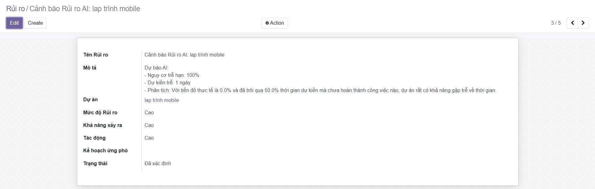

---

### **Báo cáo & Phân tích**

#### **Báo cáo Tiến độ**
Tạo các báo cáo chi tiết về tiến độ thực hiện dự án với biểu đồ trực quan. Giúp đánh giá mức độ hoàn thành so với kế hoạch.

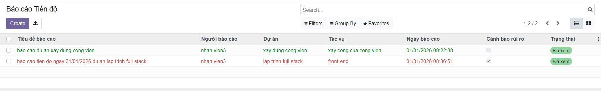

#### **Chi tiết Báo cáo Tiến độ**
Xem phân tích chi tiết về tiến độ từng giai đoạn, từng công việc, và so sánh với kế hoạch ban đầu.

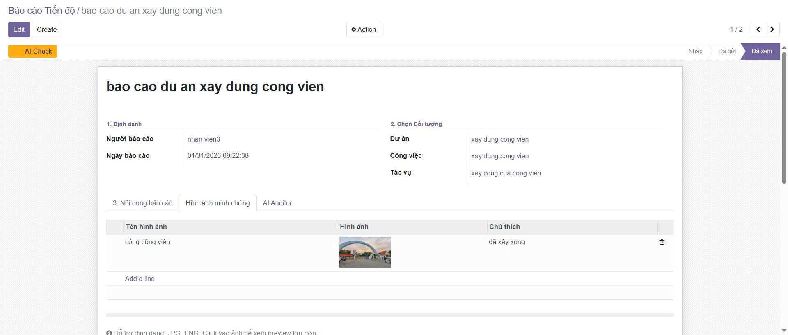

#### **Dashboard Hiệu xuất**
Bảng điều khiển tổng hợp hiển thị các chỉ số hiệu suất quan trọng (KPI) của dự án và tổ chức. Cung cấp cái nhìn toàn diện về tình hình hoạt động.

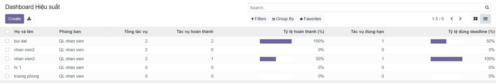

#### **Chi tiết Dashboard Hiệu xuất**
Phân tích chi tiết các chỉ số hiệu suất, bao gồm năng suất làm việc, tỷ lệ hoàn thành công việc, và đánh giá hiệu quả của từng thành viên/phòng ban.

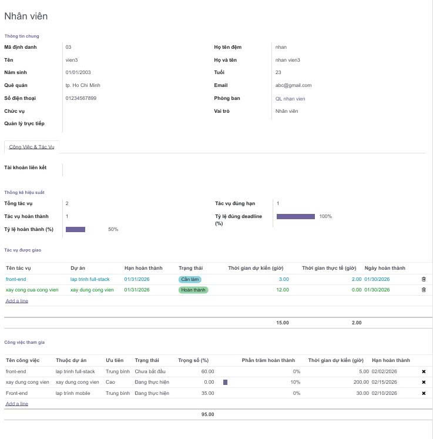

---

### **Quản lý Tổ chức**

#### **Quản lý Phòng ban**
Quản lý cơ cấu tổ chức, thông tin về các phòng ban, phân công trách nhiệm và theo dõi hoạt động của từng bộ phận.

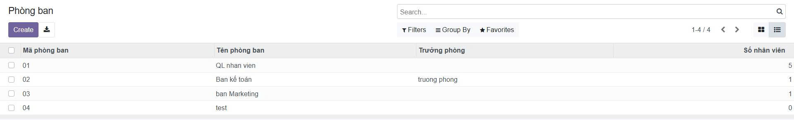

#### **Quản lý Chức vụ**
Quản lý các vị trí công việc, chức danh và phân quyền trong hệ thống. Đảm bảo cấu trúc tổ chức rõ ràng và phù hợp.

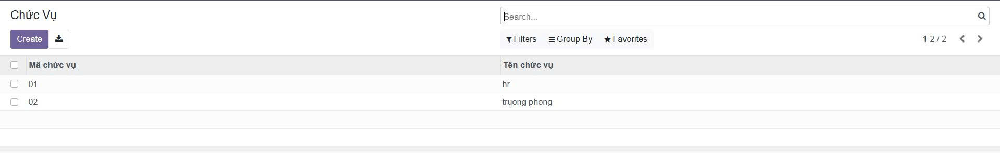

#### **Lịch Phòng ban**
Quản lý lịch làm việc, lịch họp và các sự kiện quan trọng của từng phòng ban. Giúp điều phối hoạt động và tối ưu hóa thời gian làm việc.

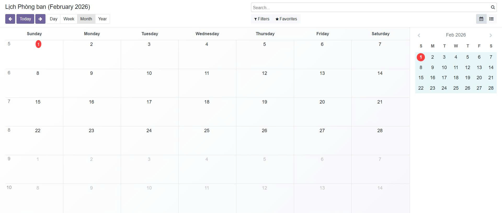

---

## Tính Năng AI Thông Minh

Hệ thống tích hợp các công nghệ AI tiên tiến để tối ưu hóa quy trình quản lý dự án, nâng cao hiệu suất làm việc và giảm thiểu rủi ro.

### **AI Đánh Giá Báo Cáo Tiến Độ**

Công nghệ AI tự động phân tích và đánh giá độ chính xác của báo cáo tiến độ khi được gửi đi. Hệ thống thông minh kiểm tra tính nhất quán giữa nội dung mô tả và hình ảnh đính kèm, đối chiếu với các chỉ số KPI và trọng số công việc, từ đó đưa ra phản hồi ngắn gọn cho người quản lý. AI cũng cảnh báo các dấu hiệu tiềm ẩn như tính trung thực của báo cáo, sự chậm trễ hoặc rủi ro có thể xảy ra, giúp nhà quản lý ra quyết định nhanh chóng và chính xác.

**Lợi ích:**
- Tự động kiểm tra và xác thực báo cáo
- Đánh giá tính chính xác và nhất quán của dữ liệu
- Phát hiện sớm các vấn đề và rủi ro tiềm ẩn
- Tiết kiệm thời gian cho người quản lý

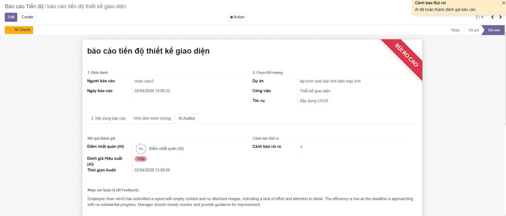

---

### **AI Dự Báo Rủi Ro Dự Án**

Hệ thống AI phân tích tổng hợp hiệu suất của các thành viên tham gia dự án để dự báo các rủi ro tiềm ẩn. Bằng cách theo dõi lịch sử hoàn thành công việc, tỷ lệ đạt deadline, khối lượng công việc, và năng suất làm việc của từng thành viên, AI có khả năng cảnh báo sớm về khả năng chậm tiến độ, quá tải nguồn lực hoặc các vấn đề về chất lượng, giúp người quản lý chủ động ngăn chặn rủi ro trước khi chúng trở nên nghiêm trọng.

**Lợi ích:**
- Dự báo các rủi ro tiềm ẩn
- Phân tích hiệu suất của thành viên
- Cảnh báo sớm về chậm tiến độ và quá tải
- Hỗ trợ ra quyết định phòng ngừa kịp thời

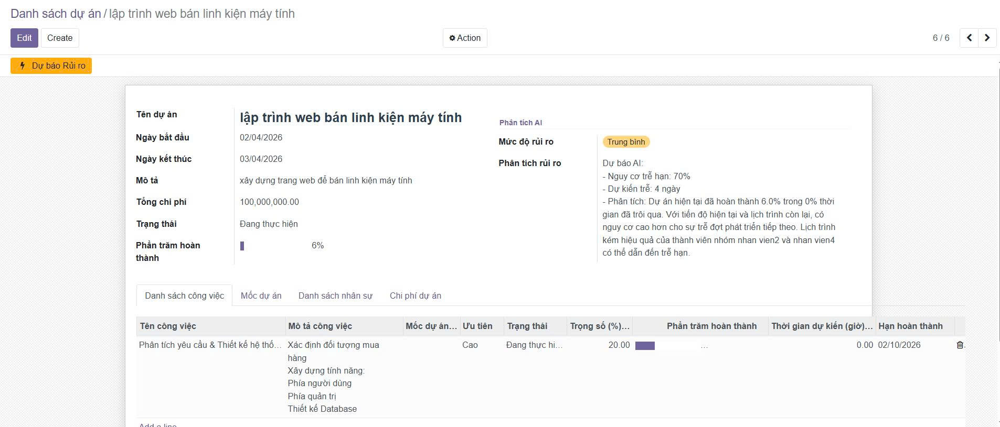

---

### **AI Gợi Ý Nhân Sự Thông Minh**

Khi có tác vụ mới hoặc cần phân công công việc, AI tự động phân tích hiệu suất làm việc của từng nhân sự trong hệ thống để đưa ra gợi ý phân bổ tối ưu. Thuật toán xem xét nhiều yếu tố như kinh nghiệm, kỹ năng chuyên môn, khối lượng công việc hiện tại, tỷ lệ hoàn thành đúng hạn, và hiệu quả làm việc trong quá khứ. Từ đó, hệ thống đề xuất người phù hợp nhất cho từng nhiệm vụ, đảm bảo phân bổ nguồn lực hợp lý và tối đa hóa năng suất tổng thể.

**Lợi ích:**
- Gợi ý nhân sự phù hợp nhất cho từng tác vụ
- Phân tích hiệu suất của thành viên
- Tối ưu hóa phân bổ nguồn nhân lực
- Cân bằng khối lượng công việc giữa các thành viên

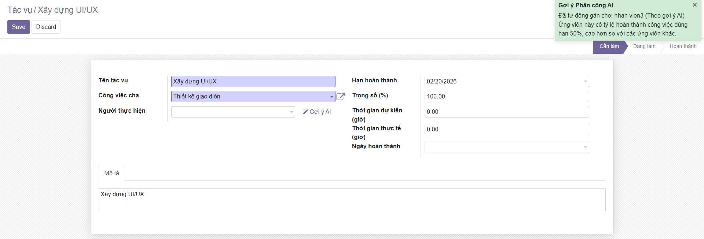

---

##  Hướng Dẫn Cài Đặt

###  Bước 1: Clone Repository

Clone dự án về máy và di chuyển vào thư mục dự án:

```bash
git clone https://github.com/dat147953/HN_QTPMDN_CNTT17_13_N3.git
cd HN_QTPMDN_CNTT17_13_N3
```

###  Bước 2: Cài Đặt Thư Viện Hệ Thống

Cài đặt các thư viện cần thiết cho Ubuntu/Linux:

```bash
sudo apt-get install libxml2-dev libxslt-dev libldap2-dev libsasl2-dev libssl-dev python3.10-distutils python3.10-dev build-essential libssl-dev libffi-dev zlib1g-dev python3.10-venv libpq-dev
```

###  Bước 3: Tạo Môi Trường Ảo Python

Khởi tạo môi trường ảo và cài đặt các dependencies Python:

```bash
# Tạo môi trường ảo
python3.10 -m venv ./venv

# Kích hoạt môi trường ảo
source venv/bin/activate

# Cài đặt các thư viện Python
pip3 install -r requirements.txt
```

###  Bước 4: Thiết Lập Database

Cài đặt Docker Compose và khởi tạo PostgreSQL database:

```bash
# Cài đặt Docker Compose
sudo apt install docker-compose

# Khởi động database container
sudo docker-compose up -d
```

###  Bước 5: Cấu Hình Hệ Thống

Tạo file **`odoo.conf`** trong thư mục gốc của dự án với nội dung sau:

```bash
[options]
addons_path = addons
db_host = localhost
db_password = odoo
db_user = odoo
db_port = 5434
xmlrpc_port = 8069
```

###  Bước 6: Chạy Ứng Dụng

Khởi động hệ thống Odoo:

```bash
python3 odoo-bin.py -c odoo.conf -u all
```

###  Bước 7: Truy Cập Hệ Thống

Mở trình duyệt và truy cập:

[http://localhost:8069/](http://localhost:8069/)

<div align="center">

**Hoàn Tất!**

</div>

---

## Nguồn Tham Khảo

**Repository GitHub:**

- **Tên dự án:** TTDN-15-04-N1
- **Tác giả:** tungthanh1928
- **Link:** [https://github.com/tungthanh1928/TTDN-15-04-N1](https://github.com/tungthanh1928/TTDN-15-04-N1.git)

